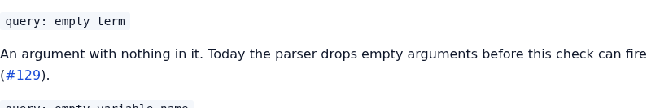
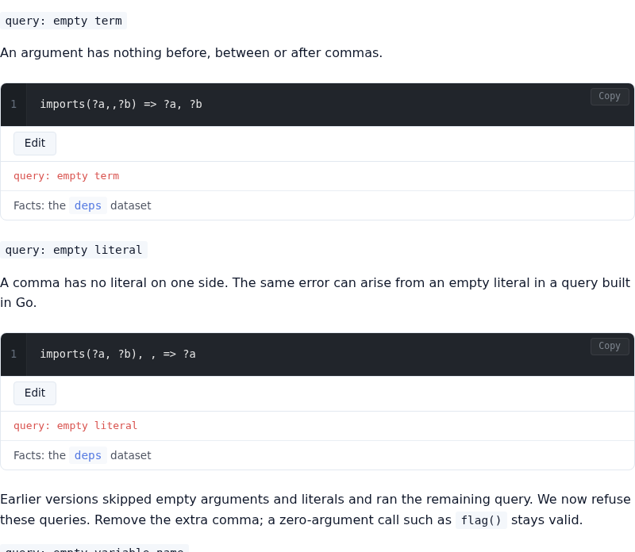
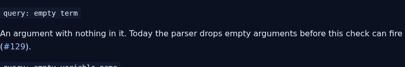
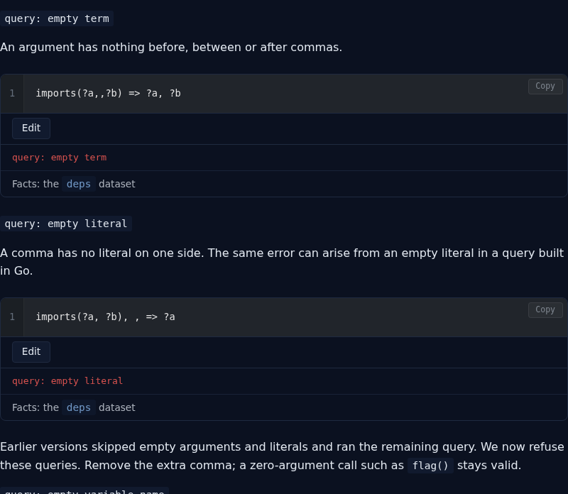
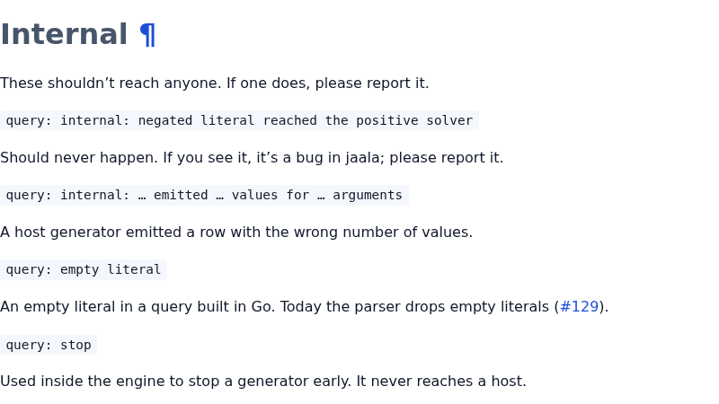
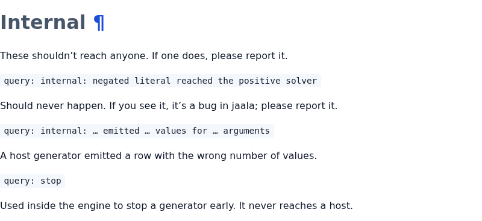
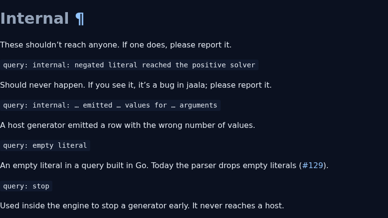
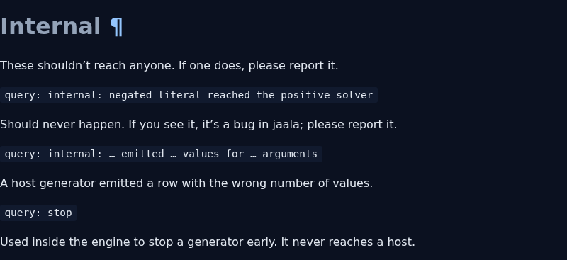

# Jaala #129 screenshots

Before images show commit `a8481f9bc4b1c837e51db0dce4c06bb1e2d82725`.
After images show the source in commit `49a938401fda5561ac0c7c86bb64a08a578dfef9`.
Playwright 1.61.1 captured both themes at a 1440 × 1000 viewport.

| Section | Theme | Before | After |
| --- | --- | --- | --- |
| Empty arguments and literals | Light |  |  |
| Empty arguments and literals | Dark |  |  |
| Internal errors | Light |  |  |
| Internal errors | Dark |  |  |
